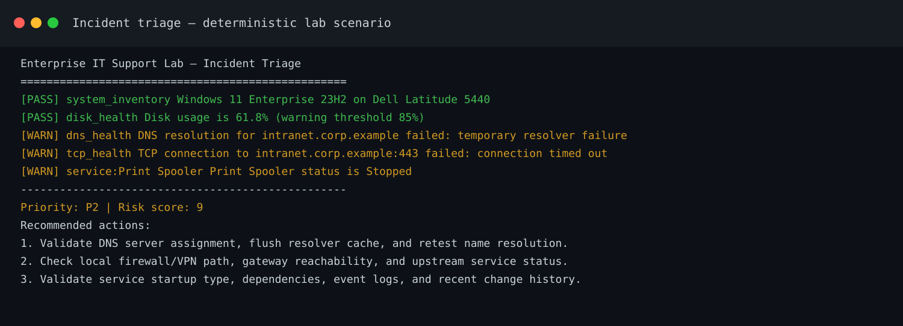
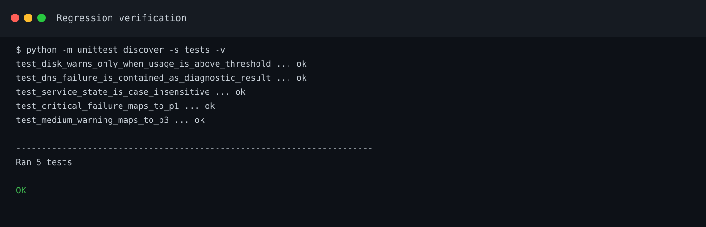
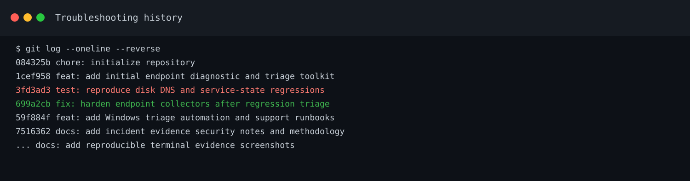
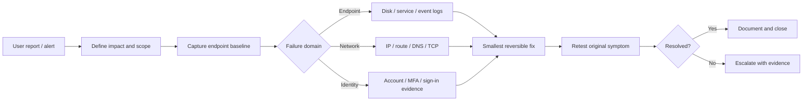

# Enterprise IT Support Lab

A practical endpoint-support and incident-triage lab built around the kind of work handled by an experienced IT technician: gathering evidence before making changes, narrowing a fault across endpoint/network/service layers, using safe PowerShell remediation, and handing off incidents with useful technical context.

The repository also keeps a visible troubleshooting history. The first diagnostic version contained three defects; regression tests were then added to reproduce them, followed by a separate repair commit and verification. This is intentional so the Git history shows investigation and correction rather than only a polished final state.

> **Lab scope:** all endpoint names, asset details, incidents, and screenshots in this repository are fictional or locally generated. Nothing here represents access to a production company environment.

## What this project demonstrates

- Windows endpoint triage with PowerShell
- DNS, TCP/443, disk, and service-health checks
- Windows Event Log evidence collection
- Incident priority scoring and structured reports
- Safe administrative remediation using `SupportsShouldProcess`
- Troubleshooting runbooks for common service-desk / desktop-support incidents
- Regression testing and root-cause documentation
- Git-based change history and GitHub Actions CI
- Security-aware evidence handling and escalation notes

## Evidence

### Incident triage output

The demo below is generated from a deterministic support scenario: healthy endpoint inventory/disk state, failed DNS and HTTPS reachability, and a stopped Print Spooler service.



### Regression verification

The current suite verifies the collector defects discovered during the lab.



### Troubleshooting history

The repository history keeps defect reproduction and repair as separate commits.



## Support workflow



The detailed workflow is in [`docs/TROUBLESHOOTING-METHODOLOGY.md`](docs/TROUBLESHOOTING-METHODOLOGY.md).

## Repository layout

```text
enterprise-it-support-lab/
├── itsupport.py                       # Cross-platform diagnostic CLI
├── supportkit/                        # Collector, triage, and reporting modules
├── scripts/
│   ├── Invoke-EndpointTriage.ps1      # Windows endpoint evidence + triage
│   ├── Get-EventLogSnapshot.ps1       # System/Application event export
│   └── Repair-NetworkStack.ps1        # Controlled network remediation
├── tests/                             # Regression + triage tests
├── docs/
│   ├── incidents/                     # Root-cause / defect notes
│   ├── runbooks/                      # Technician troubleshooting runbooks
│   ├── screenshots/                   # Generated evidence images
│   ├── ESCALATION-MATRIX.md
│   └── TROUBLESHOOTING-METHODOLOGY.md
├── samples/                           # Deterministic incident reports and demo
├── config/policy.json                 # Lab thresholds / priority definitions
├── .github/workflows/ci.yml           # Python compile + unit test matrix
├── SECURITY.md
└── CHANGELOG.md
```

## Windows endpoint triage

Run PowerShell as appropriate for your environment. The collection script gathers information and exports evidence without changing the endpoint.

```powershell
.\scripts\Invoke-EndpointTriage.ps1 `
    -TargetHost "www.microsoft.com" `
    -DiskWarningPercent 85 `
    -CriticalServices Dnscache,Spooler `
    -OutputPath ".\artifacts\windows-endpoint-health.json"
```

Collected areas include:

- OS / hardware identity through CIM
- Fixed-disk utilization
- DNS A-record resolution
- TCP/443 reachability
- Selected Windows service state
- Recent System/Application error events
- Simple P1–P4 triage score

For focused Event Log export:

```powershell
.\scripts\Get-EventLogSnapshot.ps1 -Hours 8 -MaxEvents 100
```

## Safe network remediation

The remediation script does nothing unless a specific action is selected and supports PowerShell confirmation / `-WhatIf` behavior.

```powershell
# Preview the intended action
.\scripts\Repair-NetworkStack.ps1 -FlushDns -WhatIf

# Flush resolver cache
.\scripts\Repair-NetworkStack.ps1 -FlushDns

# Higher-impact action; review first and expect a reboot after reset
.\scripts\Repair-NetworkStack.ps1 -ResetWinsock -WhatIf
```

Broad resets are deliberately separated from diagnostics. Evidence should be captured before remediation.

## Python diagnostic CLI

Python 3.11+ is recommended. The runtime uses only the standard library.

```bash
python itsupport.py --host example.com --port 443 --disk-warn 85
```

Output is written to `artifacts/endpoint-health.json` and `artifacts/endpoint-health.md`.

## Deterministic incident demo

The sample incident does not depend on live DNS, network connectivity, or a Windows host. This keeps the portfolio evidence reproducible.

```bash
PYTHONPATH=. python samples/demo_incident.py
```

It generates structured JSON/Markdown evidence plus the terminal scenario represented in the screenshot above.

## Testing

```bash
python -m unittest discover -s tests -v
```

The regression suite covers three issues found after the initial implementation:

| Defect | Symptom | Root cause | Repair |
|---|---|---|---|
| Disk threshold | 90% used could report `PASS` at an 85% warning level | Reversed comparison | Warn when usage is `>=` threshold and validate input |
| DNS collector | Resolver failure could terminate the whole diagnostic run | Exception escaped collector boundary | Convert lookup errors into a structured `WARN` result |
| Service state | `running` could be flagged while `RUNNING` passed | Case-sensitive comparison | Normalize observed status before evaluation |

The full incident note is in [`docs/incidents/INC-001-diagnostic-regressions.md`](docs/incidents/INC-001-diagnostic-regressions.md).

## CI

GitHub Actions compiles the Python sources and runs the test suite on Python 3.11, 3.12, and 3.13 for pushes and pull requests.

The support toolkit itself uses only the Python standard library. The optional documentation rendering helper under `tools/` uses Pillow.

## Runbooks

| Runbook | Focus |
|---|---|
| [`DNS-resolution-failure.md`](docs/runbooks/DNS-resolution-failure.md) | Resolver assignment, split DNS, scope, evidence before cache changes |
| [`VPN-connectivity.md`](docs/runbooks/VPN-connectivity.md) | Internet vs tunnel vs DNS/routing vs authentication separation |
| [`Print-spooler.md`](docs/runbooks/Print-spooler.md) | Queue scope, service state, event evidence, driver/server escalation |
| [`Disk-pressure.md`](docs/runbooks/Disk-pressure.md) | Capacity triage and controlled cleanup |
| [`Account-lockout-MFA.md`](docs/runbooks/Account-lockout-MFA.md) | Identity verification, stale credentials, MFA/sign-in evidence |

## Escalation standard

A useful escalation should allow the next team to continue from the current investigation instead of repeating it. The lab escalation package includes:

- affected users/endpoints and business impact
- exact error text and timestamps with timezone
- network/DNS/service test results
- relevant Event Log entries or client logs
- recent changes
- actions already attempted and their results
- current workaround, if any

See [`docs/ESCALATION-MATRIX.md`](docs/ESCALATION-MATRIX.md).

## Security notes

No real credentials or private company data belong in this repository. Before publishing support evidence, redact usernames, email addresses, tenant IDs, serial numbers, private/internal hostnames, public IP addresses, session data, and anything covered by company privacy policy.

See [`SECURITY.md`](SECURITY.md) for the project data-handling rules.

## Design choices

**Evidence before action.** Diagnostic collection is separate from remediation so pre-change state is not lost.

**Smallest reversible change.** The remediation script exposes specific switches rather than applying a blanket network reset.

**Structured handoff.** Reports are machine-readable JSON plus technician-friendly Markdown.

**Failure containment.** A DNS problem should not prevent disk, service, or system checks from completing.

**Visible troubleshooting history.** The repository retains the regression reproduction and later fix as separate commits.

## Local verification status

At the time the evidence screenshots were generated:

```text
Ran 5 tests
OK
```

See [`CHANGELOG.md`](CHANGELOG.md) for the project progression.

## License

MIT — see [`LICENSE`](LICENSE).
