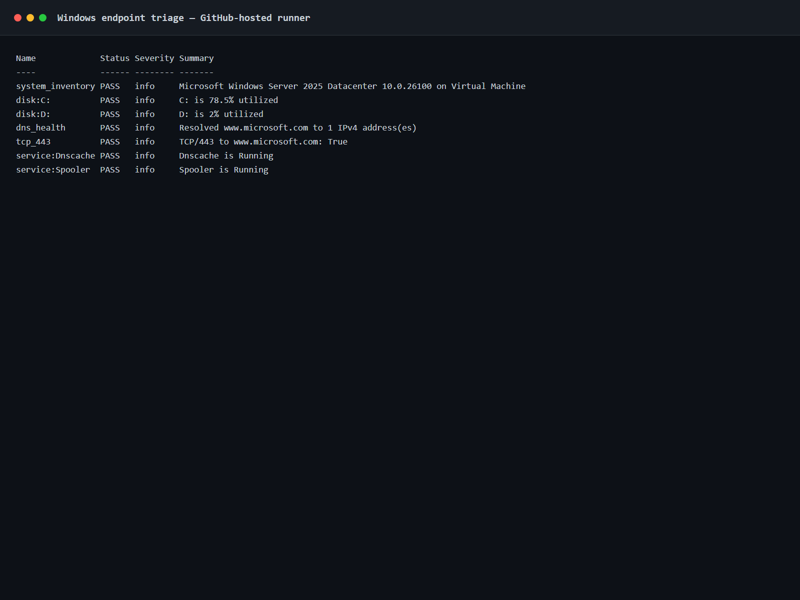
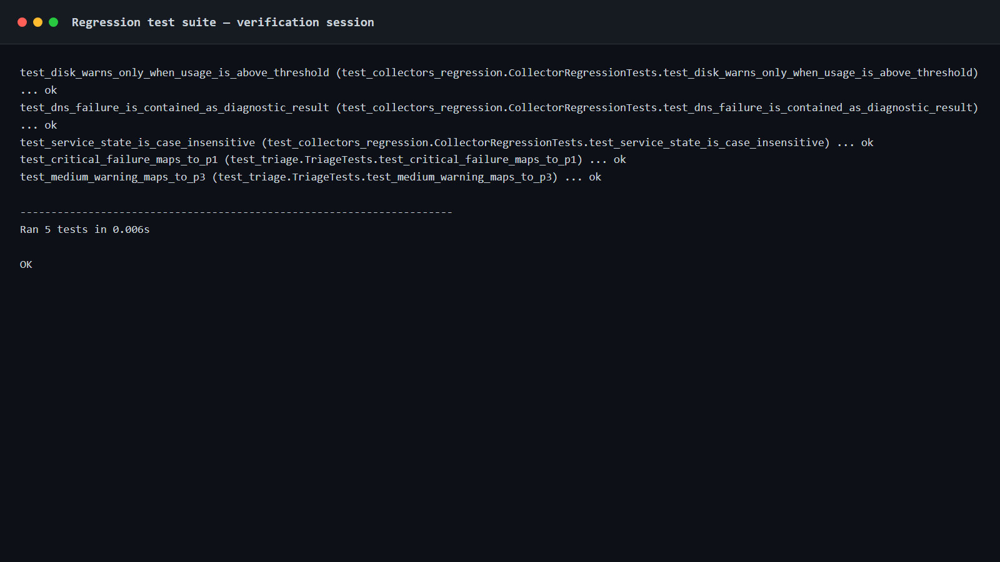
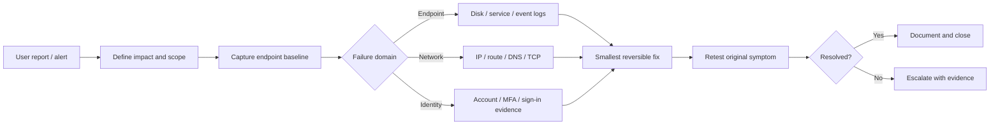

# Enterprise IT Support Lab

A Windows endpoint-support and incident-triage engineering project focused on evidence-first troubleshooting, fault isolation across endpoint/network/service layers, controlled PowerShell remediation, and escalation-ready technical documentation.

The repository also keeps a visible troubleshooting history. The first diagnostic version contained three defects; regression tests were then added to reproduce them, followed by a separate repair commit and verification. This is intentional so the Git history shows investigation and correction rather than only a polished final state.

> **Portfolio scope:** the project uses non-production test targets and sanitized sample incident data. No employer, customer, credential, or private infrastructure data is included.

## What this project demonstrates

- Windows endpoint triage with PowerShell
- DNS, TCP/443, disk, and service-health checks
- Windows Event Log evidence collection
- Incident priority scoring and structured reports
- Safe administrative remediation using `SupportsShouldProcess`
- Troubleshooting runbooks for common service-desk / desktop-support incidents
- Regression testing and root-cause documentation
- Git-based change history and GitHub Actions CI
- Security-aware evidence handling and escalation notes

## Verified evidence

The evidence below documents a completed Windows Server 2025 verification session with Python 3.13.15 and the current project code.

### Live Windows endpoint triage

The PowerShell triage script checked system inventory, fixed-disk utilization, DNS resolution, TCP/443 connectivity, and the Windows DNS Cache and Print Spooler services. All checks in the verification session passed with priority **P4 / risk score 0**.



The raw output is committed at [`docs/evidence/windows-triage.txt`](docs/evidence/windows-triage.txt), with the structured report at [`docs/evidence/windows-endpoint-health.json`](docs/evidence/windows-endpoint-health.json).

### Regression verification

The same run executed the collector and triage regression suite. **5 tests passed**.



The raw regression output is committed at [`docs/evidence/test-suite.txt`](docs/evidence/test-suite.txt).

### Troubleshooting history

Cross-environment verification exposed additional implementation issues, including a PowerShell interpolation parse error and an evidence-rendering template error. Each issue was isolated and corrected in a separate commit before final verification.

## Controlled failure case studies

The healthy verification run proves the collector works on a Windows environment. The scenarios below exercise what happens when something is actually wrong.

| Incident | Before | After | Troubleshooting focus |
|---|---|---|---|
| [DNS resolution failure](docs/incidents/INC-003-controlled-troubleshooting-scenarios.md#1-dns-resolution-failure) | WARN | PASS | Separate DNS failure from general connectivity; capture resolver state before cache changes |
| [Print Spooler outage](docs/incidents/INC-003-controlled-troubleshooting-scenarios.md#2-print-spooler-service-outage) | WARN | PASS | Check service/event evidence before changing service state |
| [Disk pressure](docs/incidents/INC-003-controlled-troubleshooting-scenarios.md#3-disk-pressure) | WARN | PASS | Identify approved cleanup scope, preview the change, then verify the original threshold |

Reproduce the sanitized evidence:

```bash
PYTHONPATH=. python samples/controlled_incidents.py
python -m unittest discover -s tests -v
```

The committed before/after evidence is in [`docs/evidence/incidents/controlled-incidents.md`](docs/evidence/incidents/controlled-incidents.md).

Remediation helpers default to preview/no-change behavior:

```powershell
# DNS cache
.\scripts\Repair-NetworkStack.ps1 -FlushDns -WhatIf

# Stopped service: preview by default
.\scripts\Repair-Service.ps1 -Name Spooler
.\scripts\Repair-Service.ps1 -Name Spooler -Execute -WhatIf

# Aged temporary files: inventory/preview by default
.\scripts\Invoke-DiskCleanup.ps1 -Path $env:TEMP -OlderThanDays 7
.\scripts\Invoke-DiskCleanup.ps1 -Path $env:TEMP -OlderThanDays 7 -Execute -WhatIf
```

These are controlled lab failures with sanitized data, not customer incidents.

## Support workflow



The detailed workflow is in [`docs/TROUBLESHOOTING-METHODOLOGY.md`](docs/TROUBLESHOOTING-METHODOLOGY.md).

## Repository layout

```text
enterprise-it-support-lab/
├── itsupport.py                       # Cross-platform diagnostic CLI
├── supportkit/                        # Collector, triage, and reporting modules
├── scripts/
│   ├── Invoke-EndpointTriage.ps1      # Windows endpoint evidence + triage
│   ├── Get-EventLogSnapshot.ps1       # System/Application event export
│   └── Repair-NetworkStack.ps1        # Controlled network remediation
├── tests/                             # Regression + triage tests
├── docs/
│   ├── incidents/                     # Root-cause / defect notes
│   ├── runbooks/                      # Technician troubleshooting runbooks
│   ├── evidence/                      # Verification output and structured reports
│   ├── screenshots/                   # Verification evidence
│   ├── ESCALATION-MATRIX.md
│   └── TROUBLESHOOTING-METHODOLOGY.md
├── samples/                           # Deterministic incident reports and demo
├── config/policy.json                 # Lab thresholds / priority definitions
├── .github/workflows/ci.yml           # Python compile + unit test matrix
├── SECURITY.md
└── CHANGELOG.md
```

## Windows endpoint triage

Run PowerShell as appropriate for your environment. The collection script gathers information and exports evidence without changing the endpoint.

```powershell
.\scripts\Invoke-EndpointTriage.ps1 `
    -TargetHost "www.microsoft.com" `
    -DiskWarningPercent 85 `
    -CriticalServices Dnscache,Spooler `
    -OutputPath ".\artifacts\windows-endpoint-health.json"
```

Collected areas include:

- OS / hardware identity through CIM
- Fixed-disk utilization
- DNS A-record resolution
- TCP/443 reachability
- Selected Windows service state
- Recent System/Application error events
- Simple P1–P4 triage score

For focused Event Log export:

```powershell
.\scripts\Get-EventLogSnapshot.ps1 -Hours 8 -MaxEvents 100
```

## Safe network remediation

The remediation script does nothing unless a specific action is selected and supports PowerShell confirmation / `-WhatIf` behavior.

```powershell
# Preview the intended action
.\scripts\Repair-NetworkStack.ps1 -FlushDns -WhatIf

# Flush resolver cache
.\scripts\Repair-NetworkStack.ps1 -FlushDns

# Higher-impact action; review first and expect a reboot after reset
.\scripts\Repair-NetworkStack.ps1 -ResetWinsock -WhatIf
```

Broad resets are deliberately separated from diagnostics. Evidence should be captured before remediation.

## Python diagnostic CLI

Python 3.11+ is recommended. The runtime uses only the standard library.

```bash
python itsupport.py --host example.com --port 443 --disk-warn 85
```

Output is written to `artifacts/endpoint-health.json` and `artifacts/endpoint-health.md`.

## Controlled incident demo

The sample incident is a separate controlled scenario used to exercise reporting and prioritization without depending on a specific external outage. It is not presented as production evidence.

```bash
PYTHONPATH=. python samples/demo_incident.py
```

It generates structured JSON/Markdown evidence plus the terminal scenario represented in the screenshot above.

## Testing

```bash
python -m unittest discover -s tests -v
```

The regression suite covers three issues found after the initial implementation:

| Defect | Symptom | Root cause | Repair |
|---|---|---|---|
| Disk threshold | 90% used could report `PASS` at an 85% warning level | Reversed comparison | Warn when usage is `>=` threshold and validate input |
| DNS collector | Resolver failure could terminate the whole diagnostic run | Exception escaped collector boundary | Convert lookup errors into a structured `WARN` result |
| Service state | `running` could be flagged while `RUNNING` passed | Case-sensitive comparison | Normalize observed status before evaluation |

The full incident note is in [`docs/incidents/INC-001-diagnostic-regressions.md`](docs/incidents/INC-001-diagnostic-regressions.md).

## CI

GitHub Actions compiles the Python sources and runs the test suite on Python 3.11, 3.12, and 3.13 for pushes and pull requests.

The support toolkit itself uses only the Python standard library. Continuous integration validates the Python code across supported versions, while the Windows verification path exercises the PowerShell endpoint checks in a Windows environment.

## Runbooks

| Runbook | Focus |
|---|---|
| [`DNS-resolution-failure.md`](docs/runbooks/DNS-resolution-failure.md) | Resolver assignment, split DNS, scope, evidence before cache changes |
| [`VPN-connectivity.md`](docs/runbooks/VPN-connectivity.md) | Internet vs tunnel vs DNS/routing vs authentication separation |
| [`Print-spooler.md`](docs/runbooks/Print-spooler.md) | Queue scope, service state, event evidence, driver/server escalation |
| [`Disk-pressure.md`](docs/runbooks/Disk-pressure.md) | Capacity triage and controlled cleanup |
| [`Account-lockout-MFA.md`](docs/runbooks/Account-lockout-MFA.md) | Identity verification, stale credentials, MFA/sign-in evidence |

## Escalation standard

A useful escalation should allow the next team to continue from the current investigation instead of repeating it. The lab escalation package includes:

- affected users/endpoints and business impact
- exact error text and timestamps with timezone
- network/DNS/service test results
- relevant Event Log entries or client logs
- recent changes
- actions already attempted and their results
- current workaround, if any

See [`docs/ESCALATION-MATRIX.md`](docs/ESCALATION-MATRIX.md).

## Security notes

No real credentials or private company data belong in this repository. Before publishing support evidence, redact usernames, email addresses, tenant IDs, serial numbers, private/internal hostnames, public IP addresses, session data, and anything covered by company privacy policy.

See [`SECURITY.md`](SECURITY.md) for the project data-handling rules.

## Design choices

**Evidence before action.** Diagnostic collection is separate from remediation so pre-change state is not lost.

**Smallest reversible change.** The remediation script exposes specific switches rather than applying a blanket network reset.

**Structured handoff.** Reports are machine-readable JSON plus technician-friendly Markdown.

**Failure containment.** A DNS problem should not prevent disk, service, or system checks from completing.

**Visible troubleshooting history.** The repository retains the regression reproduction and later fix as separate commits.

## Verification status

Latest verification snapshot:

- Windows Server 2025 Datacenter
- DNS resolution: PASS
- TCP/443 to `www.microsoft.com`: PASS
- DNS Cache service: PASS
- Print Spooler service: PASS
- Disk threshold checks: PASS
- Regression suite: **5/5 PASS**

See [`CHANGELOG.md`](CHANGELOG.md) for the project progression.

## License

MIT — see [`LICENSE`](LICENSE).
